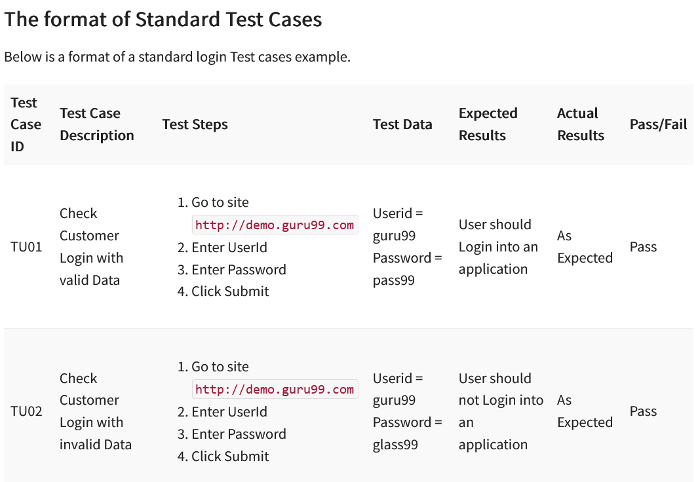

<h1>Functional Testing</h1>

**CS297 Programming Capstone**

<h2>Schedule</h2>

| Sprint | Week | Focus                                              |      | Sprint | Week | Focus                        |
| ------ | ---- | -------------------------------------------------- | ---- | ------ | ---- | ---------------------------- |
| 1      | 1    | Design review project mgmt. Git workflow |      | 4      | 7    | DevOps                       |
|        | 2    | End of sprint meetings                             |      |        | 8    | <u>Beta release</u>          |
| 2      | 3    |                                                    |      | 5      | 9    | Code freeze                  |
|        | 4    | <mark>Functional testing</mark>                    |      |        | 10   | <u>Release to production</u> |
| 3      | 5    | Continuous Integration                             |      |        | 11   | Final presentation           |
|        | 6    | Continuous Deployment <u>Alpha release</u>    |      |        |      |                              |

<h2>Contents</h2>

[TOC]

## Overview of Functional Testing

Functional tests confirm that a software application or system operates correctly. Functional testing focuses on <u>testing the user interface</u> of the application to ensure that all user stories for an application  have been correctly implemented.

Functional testing is "Black box" (vs "White box" testing)

- Black box tests use the application's user interfaces and public APIs
- White box tests use internal interfaces - unit tests are an example

### Staging for Testing Web Apps

Multiple sites (can all be on the same server)

- Development site
- Staging (testing) site
- Production site

## Writing a Test Procedure

Here is an example taken from Hamilton (2022) :

## Keep Updating the Procedure

You will use this test procedure to veryify your site is working correctly before each release:

- Alpha
- Beta
- Production

Make sure the test procedure is up to date with any changes or new features you've added since the last revision of the procedure.

## Bug Tracking

#### Bug / issue tracking systems

- Specialized for bug tracking
  - BugZilla](https://www.bugzilla.org)
  - [Mantis](http://www.mantisbt.org)
  - GitHub Issues

- Agile project management systems which include issue tracking:
  - Jira
  - Pivotal Tracker
  - ZenHub
  - Azure DevOps Boards

#### Make bug reports useful
Ask your testers to enter the following information:

- A descriptive title

- Steps to reproduce the bug

- Description of the failure
  - Include any error messages
  - Include a screen-shot if needed

##  References

Ashley Dotterweich, [What is Functional Testing?](https://dzone.com/articles/what-is-functional-testing), DZone article, 2016.
Functional testing focuses on  testing an application through the user interface to ensure that all  user stories have been correctly implemented.

Thomas Hamilton, [How to Write Test Cases: Sample Template with Examples](https://www.guru99.com/test-case.html), Guru99, 2019, revised 2022.
How to write a set of test cases for manually testing a software application.

Lawrence Howlett, [ How To Create Your Own Front-End Website Testing Plan](https://www.smashingmagazine.com/2014/11/how-to-create-your-own-front-end-website-testing-plan/), SmashingMag, 2014.
This article shows you what to consider when creating a front-end  testing plan and how to test efficiently across browsers, devices and  web pages.

Johan Hoberg, [Differences between Software Testing and Game Testing](http://www.gamasutra.com/blogs/JohanHoberg/20140721/221444/Differences_between_Software_Testing_and_Game_Testing.php), Gamasutra, 2014.
What is the major difference between testing an application or a software system compared to testing a game?

------

 Capstone Class Lecture Notes written by [Brian Bird](https://profbird.dev), 2019, revised <time>2023</time>, are licensed under a [Creative Commons Attribution 4.0 International License](http://creativecommons.org/licenses/by/4.0/). 