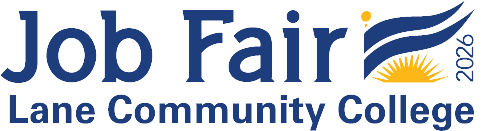

**CS297 Software Development Capstone**

<h1>Week 6 Overview for Spring 2026</h1>

<h2>May 4 through May 10</h2>

<h3>Schedule</h3>

| Sprint | Week | Focus                                                        |      | Sprint | Week | Focus                        |
| ------ | ---- | ------------------------------------------------------------ | ---- | ------ | ---- | ---------------------------- |
| 1      | 1    | Design review project mgmt. Git workflow           |      | 4      | 7    | DevOps                       |
|        | 2    | First end of sprint meetings                                 |      |        | 8    | <u>Beta release</u>          |
| 2      | 3    | Functional testing                                           |      | 5      | 9    | Code freeze                  |
|        | 4    |                                                              |      |        | 10   | <u>Release to production</u> |
| 3      | 5    | Continuous Integration                                       |      |        | 11   | Final presentation           |
|        | 6    | <mark><u>Alpha release</u> Continuous Deployment</mark> |      |        |      |                              |

### Week 6 Overview

- Sprint 3
  - Alpha release at the end of this sprint (week 6)
  
    - Alpha testing before the end of the sprint:
      - UX testing
      - Functional testing
  - Product review and team retrospective meetings after the end of the sprint.
- Alpha presentations to the class by each team at the end of week 7 (next week).

## Announcements

- **LCC Job Fair 2026!**  
      

  The Lane Community College Job Fair will be May 21 from 1 p.m. - 4 p.m. on the 2nd floor of the center building. 

  **Resource:** [More Information](https://out.smore.com/e/q9cks/xd6j18?__$u__) **| Contact:** [Kirsten Rawding. 
- **Summer and Fall Term Registration**  
  Registration is now open&mdash;but there are issues with the registration system, so wait until you hear that those have been fixed.

## Due This Week

- Individual Progress Report 6, due Sunday May 10.
- Sprint 3 meeting reports, due within three days of the end of your sprint.

------

Capstone Class Lecture Notes by [Brian Bird](https://profbird.dev), <time>2026</time>, are licensed under a [Creative Commons Attribution 4.0 International License](http://creativecommons.org/licenses/by/4.0/). 

------

